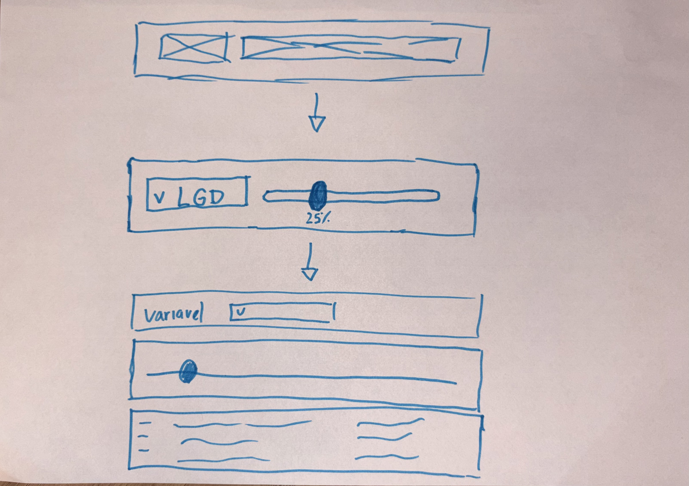
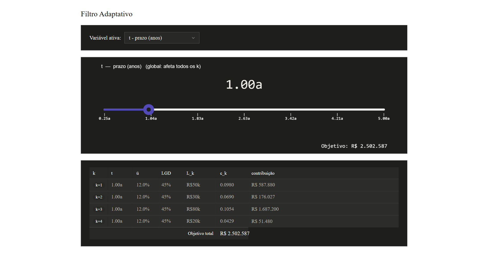

# Filtro Adaptativo — Documentação

## 1. Introdução à proposta

O projeto do Banco Pan exige a definição de uma função objetivo linear que equilibra retorno esperado e risco de inadimplência.

O filtro adaptativo foi desenvolvido exatamente para isso: permitir a exploração interativa dos parâmetros controláveis da função objetivo, **ū** (taxa), **t** (prazo), **LGD** (perda dado default) e **L_k** (limite ofertado), visualizando em tempo real como cada escolha afeta a rentabilidade da carteira antes de qualquer execução formal do modelo de otimização.

---

## 2. Rascunhos iniciais

---

## 3. Registro do resultado obtido

A ferramenta desenvolvida em p5.js + HTML permite:

- Selecionar qual variável está sendo ajustada via dropdown
- Arrastar um slider para modificar o valor em tempo real
- Visualizar na tabela como **c_k** (retorno unitário do segmento) e a **contribuição total** de cada segmento se alteram
- Acompanhar o **objetivo total da carteira** atualizado instantaneamente

A tabela exibe os quatro parâmetros ajustáveis lado a lado para todos os segmentos k, com destaque visual na variável ativa, facilitando a identificação de combinações viáveis — por exemplo, pares de ū e t que mantêm c_k positivo em todos os segmentos, ou valores de L_k compatíveis com as restrições de alavancagem do banco.